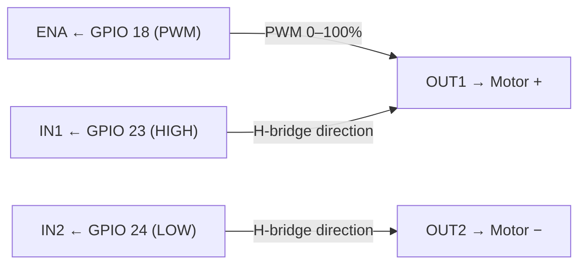

# L298N Motor Driver Module — Pinout Reference

**Component**: L298N Dual H-Bridge Motor Driver Module

## Module Layout

```text
┌──────────────────────────────────────────────┐
│  [Motor A]        [Motor B]                  │
│  OUT1  OUT2       OUT3  OUT4                  │
│                                              │
│  ┌──────────────────────────────────────┐    │
│  │           L298N IC                   │    │
│  └──────────────────────────────────────┘    │
│                                              │
│  12V  GND  5V   │  ENB  IN4 IN3 IN2 IN1 ENA │
└──────────────────────────────────────────────┘
     Power Rail         Control Pins
```

## Pin Descriptions

### Power Rail (screw terminals, left side)

| Pin | Label | Description | Connection |
|-----|-------|-------------|------------|
| 1 | 12V | Motor supply voltage (6V–35V) | 12V power supply + |
| 2 | GND | Common ground | 12V supply − and Pi GND |
| 3 | 5V | Logic power output or input | Pi 5V (pin 2) |

**Note**: The 5V pin can supply ~0.5A to power the Pi (not
recommended — use a dedicated Pi power supply). Connect Pi 5V → 5V
pin to supply logic power to L298N instead.

### Control Header (2.54mm header, right side)

| Pin | Label | Description | Piedalmetry |
|-----|-------|-------------|------------|
| 1 | ENA | Enable A — PWM speed control for OUT1/OUT2 | GPIO 18 (BCM) |
| 2 | IN1 | Direction input 1 for Motor A | GPIO 23 (BCM) |
| 3 | IN2 | Direction input 2 for Motor A | GPIO 24 (BCM) |
| 4 | IN3 | Direction input 1 for Motor B | Not used |
| 5 | IN4 | Direction input 2 for Motor B | Not used |
| 6 | ENB | Enable B — speed control for OUT3/OUT4 | Not used |

### Motor Screw Terminals

| Terminal | Label | Description | Connection |
|----------|-------|-------------|------------|
| Motor A + | OUT1 | Motor A output 1 | Motor + |
| Motor A − | OUT2 | Motor A output 2 | Motor − |
| Motor B + | OUT3 | Motor B output 1 | Not used |
| Motor B − | OUT4 | Motor B output 2 | Not used |

## ENA Jumper

Most L298N modules ship with a **shorting jumper on ENA** that ties
it to +5V (always enabled). This must be **removed** to enable PWM
speed control:

```text
BEFORE (shipped):           AFTER (Piedalmetry):
  ┌─────┐                     ┌─────┐
  │█████│ ← jumper in place   │     │ ← jumper removed
  └─────┘                     └─────┘
  ENA   5V                    ENA   5V
```

If the jumper is not removed, the motor runs at full speed regardless
of GPIO 18 PWM signal.

## Motor A Wiring for Piedalmetry



Piedalmetry sets IN1=HIGH, IN2=LOW at startup (forward direction). The
ENA pin receives PWM from GPIO 18 to control speed. The motor spins
as long as ENA duty > 0% and IN1/IN2 are correctly set.

## Current and Voltage Limits

| Parameter | Value |
|-----------|-------|
| Max motor supply voltage | 35V DC |
| Motor supply voltage range | 6V–35V |
| Max continuous current per channel | 2A |
| Peak current per channel | 3A |
| Logic voltage | 3.3V–5V |

A 12V, 1A supply is sufficient for a single small rumble motor.

## Heat Dissipation

The L298N generates significant heat under load. The heatsink on the
module is often inadequate for sustained 2A operation. For a single
rumble motor at low duty cycles (typical Piedalmetry use), the default
heatsink is sufficient.
