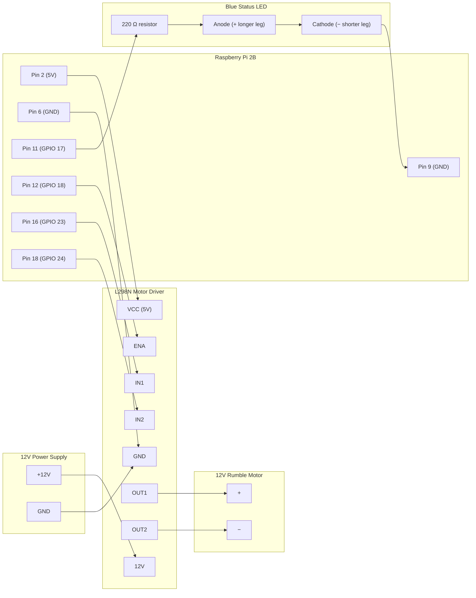

# Wiring: Raspberry Pi 2B → L298N → Motor

**Caution**: A wiring mistake can destroy hardware. Follow this guide
exactly. Double-check every connection before applying power.

## Overview

```text
[12V Supply] ──┬──► [L298N 12V]
               │
              GND ──► [L298N GND] ──► [Pi GND]

[Pi 5V (pin 2)] ──► [L298N VCC 5V]

[Pi GPIO 18 (pin 12)] ──► [L298N ENA]  (PWM speed)
[Pi GPIO 23 (pin 16)] ──► [L298N IN1]  (direction)
[Pi GPIO 24 (pin 18)] ──► [L298N IN2]  (direction)

[L298N OUT1] ──► [Motor +]
[L298N OUT2] ──► [Motor −]

[Pi GPIO 17 (pin 11)] ──► [220 Ω resistor] ──► [Blue LED anode (longer leg)]
[Blue LED cathode (shorter leg)] ──► [Pi GND (pin 9)]
```

## Wiring Topology



## Connection Table

### Motor driver (L298N)

| Pi Physical Pin | Pi BCM | Signal | L298N Pin | Notes |
|-----------------|--------|--------|-----------|-------|
| Pin 2 | 5V | Logic power | VCC | 5V logic supply for L298N |
| Pin 6 | GND | Ground | GND | Common ground (Pi + 12V supply) |
| Pin 12 | GPIO 18 | ENA (PWM) | ENA | Remove ENA jumper from L298N |
| Pin 16 | GPIO 23 | IN1 | IN1 | Direction control |
| Pin 18 | GPIO 24 | IN2 | IN2 | Direction control |

| L298N Terminal | Connection | Notes |
|----------------|------------|-------|
| 12V | 12V supply + | Separate 12V supply for motor |
| GND | 12V supply − and Pi GND | Must be common |
| OUT1 | Motor + | Polarity determines spin direction |
| OUT2 | Motor − | Swap OUT1/OUT2 to reverse direction |

### Blue connection status LED

| Pi Physical Pin | Pi BCM | Signal | Notes |
|-----------------|--------|--------|-------|
| Pin 11 | GPIO 17 | LED anode — longer leg (via resistor) | Hardcoded, no config entry |
| Pin 9 | GND | LED cathode — shorter leg | Any GND pin works |

Wire in series: `Pi GPIO 17 → 220 Ω → LED anode (longer leg) → LED cathode (shorter leg) → Pi GND`.

The LED turns on when the first GT7 telemetry packet is received, and turns off when the connection is lost (3 consecutive receive timeouts) or when the service stops.

**Boot-time state**: GPIO 17 floats HIGH during boot, which lights the LED before piedalmetry starts. Fix this by adding `gpio=17=op,dl` to `/boot/config.txt` (see [docs/installation.md](../installation.md) Step 6).

Blue LEDs have a typical forward voltage of ~3.0 V, leaving only ~0.3 V across the resistor on a 3.3 V GPIO pin. With a 220 Ω resistor that is roughly 1–2 mA — enough to see the LED in low light but visibly dim in daylight. This is a hardware limitation of driving blue LEDs from a 3.3 V rail, not a wiring error. To increase brightness, use a lower value resistor (100 Ω gives ~3 mA; 68 Ω gives ~4 mA) while staying within the Pi's 16 mA per-pin maximum.

### Foot-on-pedal sensor (optional)

| Pi Physical Pin | Pi BCM | Signal | Notes |
|-----------------|--------|--------|-------|
| Pin 40 | GPIO 21 | Foot sensor feed | Permanently HIGH — one leg of switch |
| Pin 22 | GPIO 25 | Foot sensor signal | Other leg of switch (active LOW, pull-up) |

Wire a normally-open switch between physical pin 40 (GPIO 21, feed) and physical pin 22
(GPIO 25, signal). When the foot presses the pedal the switch closes, the feed HIGH pulls
the signal LOW — detected as "foot on pedal". No external resistor or 3.3 V wire needed.

`brake_foot_sensor_enabled` in config controls only whether the motor is gated by the
sensor. The sensor circuit and foot LED are always active while the service runs.

### Foot-detection indicator LED

| Pi Physical Pin | Pi BCM | Signal | Notes |
|-----------------|--------|--------|-------|
| Pin 31 | GPIO 6 | Foot sensor LED | LOW=off, HIGH=foot detected |
| Any GND | GND | LED cathode return | |

Wire in series: `Pi GPIO 6 (pin 31) → 220 Ω → LED anode (longer leg) → LED cathode (shorter leg) → Pi GND`.
The LED turns on when a foot is detected and turns off when the foot is lifted, regardless of `brake_foot_sensor_enabled`.

## Signal Logic

Motor direction is set by IN1/IN2. Piedalmetry always drives forward
(IN1=HIGH, IN2=LOW). Reversing is not implemented.

| IN1 | IN2 | Motor state |
|-----|-----|-------------|
| HIGH | LOW | Forward (active) |
| LOW | HIGH | Reverse (not used) |
| LOW | LOW | Brake (coast/stop) |
| HIGH | HIGH | Brake (short brake) |

PWM on ENA controls speed. 0% duty = stopped, 100% = full speed.

## Voltage Levels

| Rail | Voltage | Source |
|------|---------|--------|
| Logic (VCC/INx/ENA) | 3.3V or 5V | Pi GPIO (3.3V logic, L298N accepts 3.3V) |
| Motor supply (12V) | 12V DC | Separate supply |
| Pi board power | 5V | USB or dedicated supply |

**Do NOT share the 12V supply with the Pi's USB power input.**
The Pi's USB input is 5V only.

## ENA Jumper Note

The L298N board ships with a jumper on ENA that connects it to +5V
(always-on). **Remove this jumper** before connecting GPIO 18. If the
jumper is left in place, the motor will run at full speed regardless
of PWM.

## References

- [Bornhall/gt7telemetry](https://github.com/Bornhall/gt7telemetry) —
  GT7 telemetry protocol source
- [snipem/gt7dashboard](https://github.com/snipem/gt7dashboard) —
  GT7 telemetry integration reference
