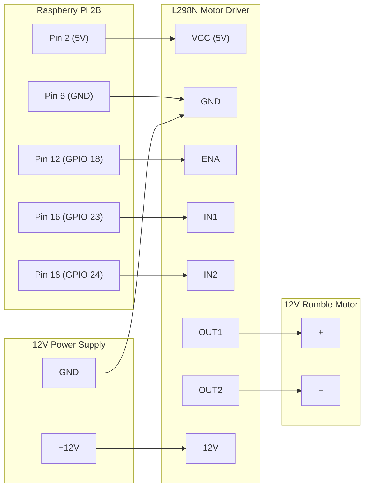

# Wiring: Raspberry Pi 2B → L298N → Motor

**Caution**: A wiring mistake can destroy hardware. Follow this guide
exactly. Double-check every connection before applying power.

## Overview

```text
[12V Supply] ──┬──► [L298N 12V]
               │
              GND ──► [L298N GND] ──► [Pi GND]

[Pi 5V (pin 2)] ──► [L298N VCC 5V]

[Pi GPIO 18 (pin 12)] ──► [L298N ENA]  (PWM speed)
[Pi GPIO 23 (pin 16)] ──► [L298N IN1]  (direction)
[Pi GPIO 24 (pin 18)] ──► [L298N IN2]  (direction)

[L298N OUT1] ──► [Motor +]
[L298N OUT2] ──► [Motor −]
```

## Wiring Topology



## Connection Table

| Pi Physical Pin | Pi BCM | Signal | L298N Pin | Notes |
|-----------------|--------|--------|-----------|-------|
| Pin 2 | 5V | Logic power | VCC | 5V logic supply for L298N |
| Pin 6 | GND | Ground | GND | Common ground (Pi + 12V supply) |
| Pin 12 | GPIO 18 | ENA (PWM) | ENA | Remove ENA jumper from L298N |
| Pin 16 | GPIO 23 | IN1 | IN1 | Direction control |
| Pin 18 | GPIO 24 | IN2 | IN2 | Direction control |

| L298N Terminal | Connection | Notes |
|----------------|------------|-------|
| 12V | 12V supply + | Separate 12V supply for motor |
| GND | 12V supply − and Pi GND | Must be common |
| OUT1 | Motor + | Polarity determines spin direction |
| OUT2 | Motor − | Swap OUT1/OUT2 to reverse direction |

## Signal Logic

Motor direction is set by IN1/IN2. Piedalmetry always drives forward
(IN1=HIGH, IN2=LOW). Reversing is not implemented.

| IN1 | IN2 | Motor state |
|-----|-----|-------------|
| HIGH | LOW | Forward (active) |
| LOW | HIGH | Reverse (not used) |
| LOW | LOW | Brake (coast/stop) |
| HIGH | HIGH | Brake (short brake) |

PWM on ENA controls speed. 0% duty = stopped, 100% = full speed.

## Voltage Levels

| Rail | Voltage | Source |
|------|---------|--------|
| Logic (VCC/INx/ENA) | 3.3V or 5V | Pi GPIO (3.3V logic, L298N accepts 3.3V) |
| Motor supply (12V) | 12V DC | Separate supply |
| Pi board power | 5V | USB or dedicated supply |

**Do NOT share the 12V supply with the Pi's USB power input.**
The Pi's USB input is 5V only.

## ENA Jumper Note

The L298N board ships with a jumper on ENA that connects it to +5V
(always-on). **Remove this jumper** before connecting GPIO 18. If the
jumper is left in place, the motor will run at full speed regardless
of PWM.

## References

- [Bornhall/gt7telemetry](https://github.com/Bornhall/gt7telemetry) —
  GT7 telemetry protocol source
- [snipem/gt7dashboard](https://github.com/snipem/gt7dashboard) —
  GT7 telemetry integration reference
